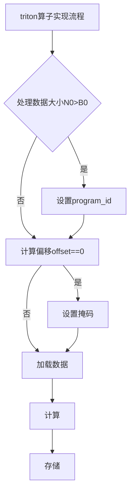

triton算子实现有流程

判断处理数据的大小(B0 >= N0)

```mermaid
graph TD
    A[triton算子实现流程] --> B{处理数据大小N0>B0};
    B -- 是 --> C[设置program_id];
    B -- 否 --> D[计算偏移];
    C --> D[计算偏移offset==0];
    D -- 是 --> E[设置掩码];
    D -- 否 --> F[加载数据];
    E --> F[加载数据];
    F --> G[计算];
    G --> H[存储];
```
